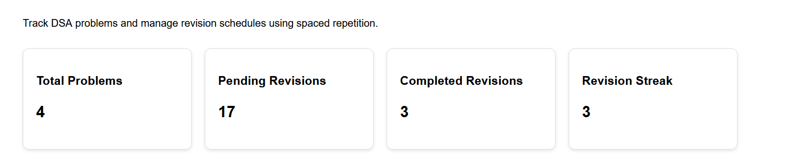
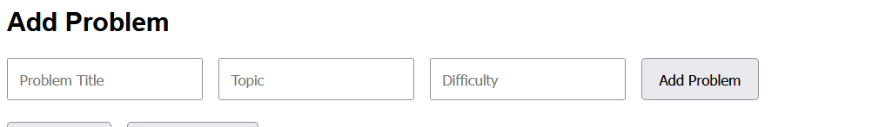
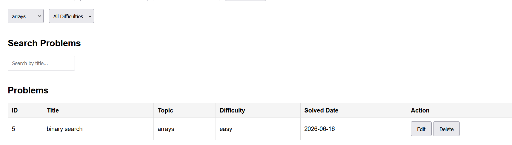
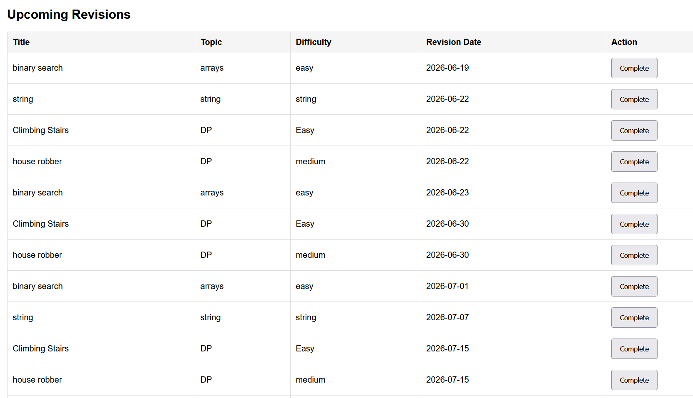
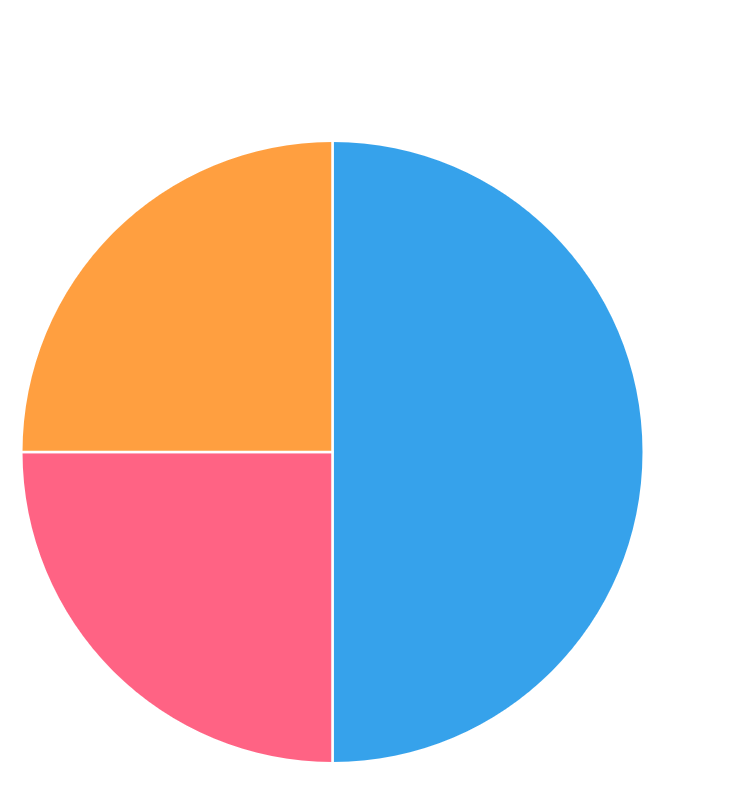
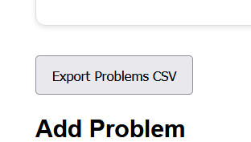

# DSA Revision Scheduler

A full-stack DSA Revision Tracking application built using **FastAPI**, **SQLite**, **HTML**, **CSS**, **JavaScript**, and **Chart.js**.

The application helps users track solved DSA problems, automatically schedule revisions using spaced repetition, monitor revision progress, and visualize learning analytics through an interactive dashboard.

---

## Features

### Problem Management

* Add DSA problems
* Edit existing problems
* Delete problems
* View all solved problems

### Search & Filtering

* Search problems by title
* Filter by topic
* Filter by difficulty

### Revision Tracking

* Automatic revision scheduling using spaced repetition
* Upcoming revisions dashboard
* Mark revisions as completed
* Completed revisions tracking
* Revision streak monitoring

### Analytics Dashboard

* Total solved problems
* Pending revisions count
* Completed revisions count
* Revision streak tracker
* Topic-wise analytics

### Data Visualization

* Interactive Pie Chart using Chart.js
* Topic distribution analytics

### Export Functionality

* Export all problems to CSV format

---

## Repository

GitHub Repository:

https://github.com/lokesh-iitm/dsa-revision-scheduler

---

## Screenshots

### Dashboard

Displays total problems, pending revisions, completed revisions, and revision streak.



---

### Add Problem

Add new DSA problems with topic and difficulty information.



---

### Search & Filters

Quickly search and filter problems by topic and difficulty.



---

### Revision Tracking

Track upcoming revisions and mark them as completed.



---

### Analytics Dashboard

Visualize topic distribution using an interactive pie chart.



---

### CSV Export

Export all stored problems into CSV format.



---

## Tech Stack

### Backend

* FastAPI
* SQLite

### Frontend

* HTML
* CSS
* JavaScript

### Data Visualization

* Chart.js

---

## Project Structure

```text
dsa-revision-scheduler
│
├── app
│   ├── database
│   │   ├── db.py
│   │   └── models.py
│   │
│   ├── routers
│   │   ├── problems.py
│   │   └── revisions.py
│   │
│   ├── schemas
│   │   └── problem.py
│   │
│   ├── static
│   │   ├── style.css
│   │   └── script.js
│   │
│   ├── templates
│   │   └── index.html
│   │
│   └── main.py
│
├── screenshots
│   ├── dashboard.png
│   ├── add-problem.png
│   ├── search-filter.png
│   ├── revisions.png
│   ├── analytics.png
│   └── csv-export.png
│
├── scheduler.db
├── requirements.txt
└── README.md
```

---

## Installation

### Clone Repository

```bash
git clone https://github.com/lokesh-iitm/dsa-revision-scheduler.git
cd dsa-revision-scheduler
```

### Create Virtual Environment

```bash
python -m venv venv
```

### Activate Virtual Environment

Windows:

```bash
venv\Scripts\activate
```

### Install Dependencies

```bash
pip install -r requirements.txt
```

### Run Application

```bash
python -m uvicorn app.main:app --reload
```

### Open Browser

```text
http://127.0.0.1:8000
```

---

## API Endpoints

### Problems

| Method | Endpoint      | Description      |
| ------ | ------------- | ---------------- |
| POST   | /problem      | Add a problem    |
| GET    | /problems     | Get all problems |
| PUT    | /problem/{id} | Update a problem |
| DELETE | /problem/{id} | Delete a problem |

### Revisions

| Method | Endpoint            | Description            |
| ------ | ------------------- | ---------------------- |
| GET    | /revisions/today    | Today's revisions      |
| GET    | /revisions/upcoming | Upcoming revisions     |
| GET    | /revisions/history  | Revision history       |
| PUT    | /revision/{id}      | Mark revision complete |

### Analytics

| Method | Endpoint              | Description          |
| ------ | --------------------- | -------------------- |
| GET    | /dashboard            | Dashboard statistics |
| GET    | /dashboard/topic-wise | Topic-wise analytics |
| GET    | /streak               | Revision streak      |
| GET    | /export               | Export data as CSV   |

---

## Future Improvements

* User Authentication
* Login & Registration
* Email Revision Reminders
* Dark Mode Support
* Cloud Deployment
* AI-Based Revision Recommendations

---

## Author

**Lokesh Prasad**

GitHub Profile:
https://github.com/lokesh-iitm

Project Repository:
https://github.com/lokesh-iitm/dsa-revision-scheduler
